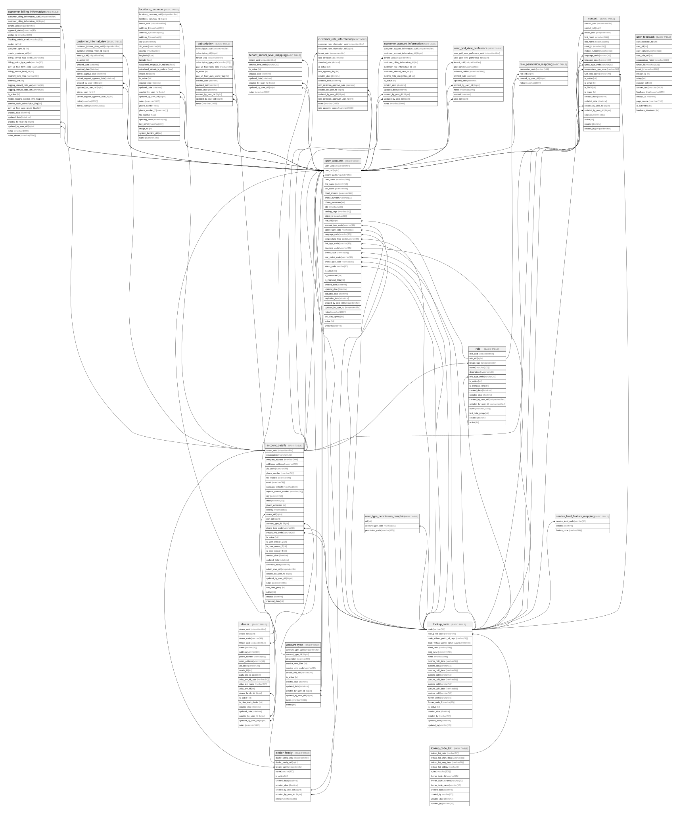

# Account

## Tables

| Name | Columns | Comment | Type |
| ---- | ------- | ------- | ---- |
| [locations_common](locations_common.md) | 28 | Used for Location-Related and Map Processes | BASIC TABLE |
| [role](role.md) | 16 | the table that stores the details of the roles | BASIC TABLE |
| [role_permission_mapping](role_permission_mapping.md) | 4 | MANY-TO-MANY relationship mapping between Role and Permission | BASIC TABLE |
| [service_level_feature_mapping](service_level_feature_mapping.md) | 3 | MANY-TO-MANY relationship mapping between Service Level and Feature | BASIC TABLE |
| [subscription](subscription.md) | 13 |  | BASIC TABLE |
| [tenant_service_level_mapping](tenant_service_level_mapping.md) | 8 | MANY-TO-MANY relationship mapping between Tenant and Service Level | BASIC TABLE |
| [user_accounts](user_accounts.md) | 36 | the table that stores the details of the users | BASIC TABLE |
| [user_feedback](user_feedback.md) | 16 | UNKNOWN Usage - Ignore for now | BASIC TABLE |
| [user_grid_view_preference](user_grid_view_preference.md) | 11 | the table that stores the details of the user preferences | BASIC TABLE |
| [user_type_permission_template](user_type_permission_template.md) | 3 |  | BASIC TABLE |
| [lookup_code](lookup_code.md) | 22 | Used for Lookup Values (formerly called Master Tables) | BASIC TABLE |
| [lookup_code_list](lookup_code_list.md) | 12 | Used for Lookup Values (formerly called Master Tables) | BASIC TABLE |
| [account_details](account_details.md) | 34 | the table that stores the details of the accounts | BASIC TABLE |
| [account_type](account_type.md) | 13 | An Account Type is a “group” of customers, It represents a “profile”. Profiles can be used across different tenants/customers. Tk_Admin and tk_Master (formerly called “celtrak service manager”) can add Account Types. | BASIC TABLE |
| [contact](contact.md) | 24 | the table that stores the details of the contacts | BASIC TABLE |
| [customer_account_information](customer_account_information.md) | 13 |  | BASIC TABLE |
| [customer_billing_information](customer_billing_information.md) | 27 |  | BASIC TABLE |
| [customer_internal_view](customer_internal_view.md) | 14 |  | BASIC TABLE |
| [customer_rate_information](customer_rate_information.md) | 15 |  | BASIC TABLE |
| [dealer](dealer.md) | 22 | this table stores dealer information | BASIC TABLE |
| [dealer_family](dealer_family.md) | 10 |  | BASIC TABLE |

## Stored procedures and functions

| Name | ReturnType | Arguments | Type |
| ---- | ------- | ------- | ---- |
| dbo.admin_role_update |  |  | SQL Stored Procedure |
| dbo.basic_role_update |  |  | SQL Stored Procedure |
| dbo.control_table_max_rid |  |  | SQL Stored Procedure |
| dbo.control_table_min_rid |  |  | SQL Stored Procedure |
| dbo.control_table_rollback |  |  | SQL Stored Procedure |
| dbo.fn_diagramobjects | int |  | SQL scalar function |
| dbo.IndexRecom_WithTempLog |  | @MinMissingIndexImprovement decimal, @MinPageCount int, @ReorganizeMinFrag decimal, @RebuildMinFrag decimal, @MinUnusedIndexUpdates bigint, @ExecuteActions bit, @IncludeCreate bit, @IncludeAlter bit, @IncludeDrop bit, @UseTransaction bit, @RollbackOnError bit, @ForceRollback bit | SQL Stored Procedure |
| dbo.sp_alterdiagram |  | @diagramname sysname, @owner_id int, @version int, @definition varbinary | SQL Stored Procedure |
| dbo.sp_creatediagram |  | @diagramname sysname, @owner_id int, @version int, @definition varbinary | SQL Stored Procedure |
| dbo.sp_dropdiagram |  | @diagramname sysname, @owner_id int | SQL Stored Procedure |
| dbo.sp_helpdiagramdefinition |  | @diagramname sysname, @owner_id int | SQL Stored Procedure |
| dbo.sp_helpdiagrams |  | @diagramname sysname, @owner_id int | SQL Stored Procedure |
| dbo.sp_renamediagram |  | @diagramname sysname, @owner_id int, @new_diagramname sysname | SQL Stored Procedure |
| dbo.sp_role_creation |  | @tenant_id nvarchar | SQL Stored Procedure |
| dbo.sp_role_permission_mapping_admin |  | @role_rid int | SQL Stored Procedure |
| dbo.sp_role_permission_mapping_basic |  | @role_rid int | SQL Stored Procedure |
| dbo.sp_update_role |  | @pipeline_run_id nvarchar | SQL Stored Procedure |
| dbo.sp_upgraddiagrams |  |  | SQL Stored Procedure |
| dbo.spr_update_tenant_lower_case |  |  | SQL Stored Procedure |
| dbo.usp_dq_data_integrity_check |  |  | SQL Stored Procedure |
| dbo.usp_dq_data_integrity_misc_check |  |  | SQL Stored Procedure |
| dbo.usp_dq_data_integrity_rid_to_uuid_check |  |  | SQL Stored Procedure |
| dbo.usp_dq_data_model_integrity_check |  | @TenantParentTable sysname, @ShowAll bit, @SkipChecks nvarchar, @PersistResults bit | SQL Stored Procedure |
| dbo.usp_ManageTablePartitioning |  | @Mode varchar, @StartDate date, @EndDate date, @MinPartitionScore int, @TargetSchema sysname, @OnlyTable sysname | SQL Stored Procedure |
| dbo.usp_seed_load_account_details |  |  | SQL Stored Procedure |
| dbo.usp_seed_load_all |  |  | SQL Stored Procedure |
| dbo.usp_seed_load_contact |  |  | SQL Stored Procedure |
| dbo.usp_seed_load_dealer |  |  | SQL Stored Procedure |
| dbo.usp_seed_load_role |  |  | SQL Stored Procedure |
| dbo.usp_seed_load_role_perm |  |  | SQL Stored Procedure |
| dbo.usp_seed_load_tenantinfo |  |  | SQL Stored Procedure |
| dbo.usp_seed_load_user_accounts |  |  | SQL Stored Procedure |
| dbo.usp_seed_load_user_grid_pref |  |  | SQL Stored Procedure |
| dbo.usp_seed_reset_all |  |  | SQL Stored Procedure |
| dbo.usp_update_extended_properties |  |  | SQL Stored Procedure |
| dbo.v2_process_contacts_changes_custom |  | @PipeLine_Run_Id nvarchar | SQL Stored Procedure |
| dbo.v2_process_contactsChanges |  |  | SQL Stored Procedure |
| dbo.v2_process_new_v1_user |  |  | SQL Stored Procedure |

## Relations

---

> Generated by [tbls](https://github.com/k1LoW/tbls)
