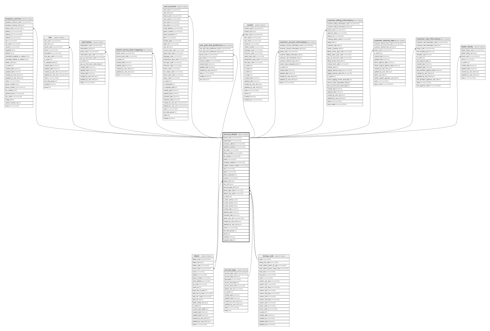

# account_details

## Description

the table that stores the details of the accounts

## Columns

| Name | Type | Default | Nullable | Children | Parents | Comment |
| ---- | ---- | ------- | -------- | -------- | ------- | ------- |
| tenant_uuid | uniqueidentifier | (newsequentialid()) | false | [locations_common](locations_common.md) [role](role.md) [subscription](subscription.md) [user_accounts](user_accounts.md) [user_grid_view_preference](user_grid_view_preference.md) [customer_account_information](customer_account_information.md) [customer_billing_information](customer_billing_information.md) [contact](contact.md) [tenant_service_level_mapping](tenant_service_level_mapping.md) [customer_internal_view](customer_internal_view.md) [customer_rate_information](customer_rate_information.md) [dealer](dealer.md) [dealer_family](dealer_family.md) |  | the uniqueidentifier for the tenant/customer.  Used as a partitioning key., Data type = uniqueidentifier, Nullable = No |
| organization | nvarchar(100) |  | false |  |  | the company name, Data type = nvarchar(200), Nullable = No |
| company_address | nvarchar(200) |  | true |  |  | the address for the company, Data type = nvarchar(400), Nullable = Yes |
| additional_address | nvarchar(200) |  | true |  |  | the second line of the address, Data type = nvarchar(400), Nullable = Yes |
| zip_code | nvarchar(50) |  | true |  |  | the zip_code of the address, Data type = nvarchar(100), Nullable = Yes |
| phone_number | nvarchar(50) |  | true |  |  | the phone number, Data type = nvarchar(100), Nullable = Yes |
| fax_number | nvarchar(50) |  | true |  |  | the fax number, Data type = nvarchar(100), Nullable = Yes |
| email | nvarchar(50) |  | true |  |  | the email address, Data type = nvarchar(100), Nullable = Yes |
| company_website | nvarchar(200) |  | true |  |  | the website of the company, Data type = nvarchar(400), Nullable = Yes |
| support_contact_number | nvarchar(50) |  | true |  |  | the phone number for support for this account, Data type = nvarchar(100), Nullable = Yes |
| city | nvarchar(50) |  | true |  |  | the city of the address, Data type = nvarchar(100), Nullable = Yes |
| state | nvarchar(50) |  | true |  |  | the state/province of the address, Data type = nvarchar(100), Nullable = Yes |
| phone_extension | int |  | true |  |  | the extension of the phone number, Data type = int, Nullable = Yes |
| country | nvarchar(50) |  | true |  |  | the country of the address, Data type = nvarchar(100), Nullable = Yes |
| dealer_rid | bigint |  | true |  | [dealer](dealer.md) | References column dealer_rid on table dealer, Data type = bigint, Nullable = Yes, References = [dbo].[dealer].[dealer_rid] |
| csm_rid | bigint |  | true |  |  | UNDER CONSTRUCTION - might be used for celtrak_service_manager (a.k.a. CSM), Data type = bigint, Nullable = Yes |
| account_type_rid | bigint | ((1)) | false |  | [account_type](account_type.md) | References column account_type_rid on table account_type, Data type = bigint, Nullable = No, References = [dbo].[account_type].[account_type_rid] |
| phone_type_code | varchar(30) |  | true |  | [lookup_code](lookup_code.md) | see lookup.code for information about these values, Data type = varchar(30), Nullable = Yes, References = [dbo].[lookup_code].[code] |
| default_role_code | varchar(30) | ('ROL_BASIC') | false |  | [lookup_code](lookup_code.md) | A lookup to the main lookup_code table, Data type = varchar(30), Nullable = No, References = [dbo].[lookup_code].[code] |
| is_active | bit | ((1)) | false |  |  | the record is active, Data type = bit, Nullable = No |
| is_door_sensor_1 | bit |  | true |  |  | the door sensor is on/off, Data type = bit, Nullable = Yes |
| is_door_sensor_2 | bit |  | true |  |  | the door sensor is on/off, Data type = bit, Nullable = Yes |
| is_door_sensor_3 | bit |  | true |  |  | the door sensor is on/off, Data type = bit, Nullable = Yes |
| created_date | datetime | (getdate()) | false |  |  | the date the record was created, Data type = datetime, Nullable = No |
| updated_date | datetime |  | true |  |  | the date the record was updated or created, Data type = datetime, Nullable = Yes |
| activated_date | datetime |  | true |  |  | the date the record was activated, Data type = datetime, Nullable = Yes |
| admin_user_rid | uniqueidentifier |  | false |  |  | the rid (integer identity) which might be deprecated and replaced by the uuid, Data type = uniqueidentifier, Nullable = No |
| created_by_user_rid | bigint |  | true |  |  |  |
| updated_by_user_rid | bigint |  | true |  |  |  |
| notes | nvarchar(1000) |  | true |  |  | Optional notes and comments about this record, Data type = nvarchar(2000), Nullable = Yes |
| test_data_group | int |  | true |  |  | used for the Dev test data process, Data type = int, Nullable = Yes |
| active | bit |  | false |  |  | DEPRECATED - replaced by is_active, Data type = bit, Nullable = No |
| created | datetime | (getdate()) | false |  |  | DEPRECATED - replaced by created_date, Data type = datetime, Nullable = No |
| migrated_data | bit | ((0)) | false |  |  | is the data from the data migration process from v1 to v2, Data type = bit, Nullable = No |

## Constraints

| Name | Type | Definition |
| ---- | ---- | ---------- |
| pk_account_details_tenant_uuid | PRIMARY KEY | CLUSTERED, unique, part of a PRIMARY KEY constraint, [ tenant_uuid ] |
| fk_account_details_account_type_rid | FOREIGN KEY | FOREIGN KEY(account_type_rid) REFERENCES account_type(account_type_rid) ON UPDATE NO_ACTION ON DELETE NO_ACTION |
| fk_account_details_dealer_rid | FOREIGN KEY | FOREIGN KEY(dealer_rid) REFERENCES dealer(dealer_rid) ON UPDATE NO_ACTION ON DELETE NO_ACTION |
| fk_account_details_default_role_code | FOREIGN KEY | FOREIGN KEY(default_role_code) REFERENCES lookup_code(code) ON UPDATE NO_ACTION ON DELETE NO_ACTION |
| fk_account_details_phone_type_code | FOREIGN KEY | FOREIGN KEY(phone_type_code) REFERENCES lookup_code(code) ON UPDATE NO_ACTION ON DELETE NO_ACTION |

## Indexes

| Name | Definition |
| ---- | ---------- |
| pk_account_details_tenant_uuid | CLUSTERED, unique, part of a PRIMARY KEY constraint, [ tenant_uuid ] |
| ix_fk_account_details_dealer_rid | NONCLUSTERED, [ dealer_rid ] |
| ix_fk_account_details_phone_type_code | NONCLUSTERED, [ phone_type_code ] |
| ix_fk_account_details_default_role_code | NONCLUSTERED, [ default_role_code ] |
| ix_fk_account_details_account_type_rid | NONCLUSTERED, [ account_type_rid ] |

## Relations

---

> Generated by [tbls](https://github.com/k1LoW/tbls)
