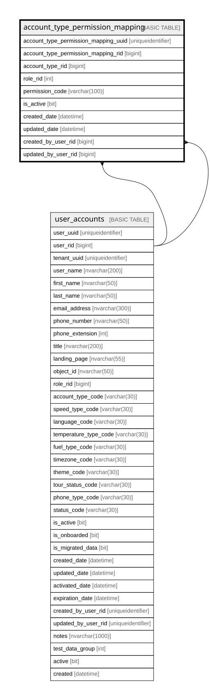

# account_type_permission_mapping

## Columns

| Name | Type | Default | Nullable | Children | Parents | Comment |
| ---- | ---- | ------- | -------- | -------- | ------- | ------- |
| account_type_permission_mapping_uuid | uniqueidentifier | (newsequentialid()) | false |  |  |  |
| account_type_permission_mapping_rid | bigint |  | false |  |  |  |
| account_type_rid | bigint |  | true |  |  |  |
| role_rid | int |  | false |  |  |  |
| permission_code | varchar(100) |  | true |  |  |  |
| is_active | bit | ((1)) | false |  |  |  |
| created_date | datetime | (getdate()) | false |  |  |  |
| updated_date | datetime |  | true |  |  |  |
| created_by_user_rid | bigint |  | true |  | [user_accounts](user_accounts.md) |  |
| updated_by_user_rid | bigint |  | true |  | [user_accounts](user_accounts.md) |  |

## Constraints

| Name | Type | Definition |
| ---- | ---- | ---------- |
| pk_account_type_permission_mapping_rid | PRIMARY KEY | CLUSTERED, unique, part of a PRIMARY KEY constraint, [ account_type_permission_mapping_rid ] |
| uk_account_type_permission_mapping_uuid | UNIQUE | NONCLUSTERED, unique, part of a UNIQUE constraint, [ account_type_permission_mapping_uuid ] |
| uk_account_type_permission_mapping_rid | UNIQUE | NONCLUSTERED, unique, part of a UNIQUE constraint, [ account_type_permission_mapping_rid ] |
| fk_account_type_permission_mapping_created_by_user_rid | FOREIGN KEY | FOREIGN KEY(created_by_user_rid) REFERENCES user_accounts(user_rid) ON UPDATE NO_ACTION ON DELETE NO_ACTION |
| fk_account_type_permission_mapping_updated_by_user_rid | FOREIGN KEY | FOREIGN KEY(updated_by_user_rid) REFERENCES user_accounts(user_rid) ON UPDATE NO_ACTION ON DELETE NO_ACTION |

## Indexes

| Name | Definition |
| ---- | ---------- |
| pk_account_type_permission_mapping_rid | CLUSTERED, unique, part of a PRIMARY KEY constraint, [ account_type_permission_mapping_rid ] |
| uk_account_type_permission_mapping_uuid | NONCLUSTERED, unique, part of a UNIQUE constraint, [ account_type_permission_mapping_uuid ] |
| uk_account_type_permission_mapping_rid | NONCLUSTERED, unique, part of a UNIQUE constraint, [ account_type_permission_mapping_rid ] |
| ix_fk_account_type_permission_mapping_created_by_user_rid | NONCLUSTERED, [ created_by_user_rid ] |
| ix_fk_account_type_permission_mapping_updated_by_user_rid | NONCLUSTERED, [ updated_by_user_rid ] |

## Relations

---

> Generated by [tbls](https://github.com/k1LoW/tbls)
