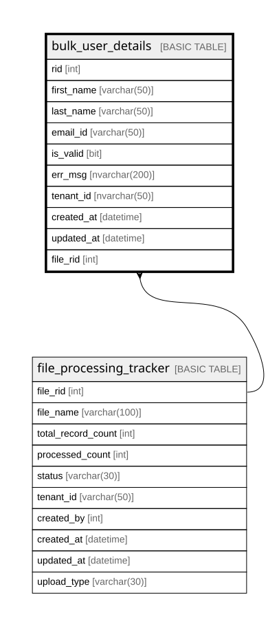

# bulk_user_details

## Columns

| Name | Type | Default | Nullable | Children | Parents | Comment |
| ---- | ---- | ------- | -------- | -------- | ------- | ------- |
| rid | int |  | false |  |  |  |
| first_name | varchar(50) |  | true |  |  |  |
| last_name | varchar(50) |  | true |  |  |  |
| email_id | varchar(50) |  | true |  |  |  |
| is_valid | bit |  | true |  |  |  |
| err_msg | nvarchar(200) |  | true |  |  |  |
| tenant_id | nvarchar(50) |  | true |  |  |  |
| created_at | datetime |  | true |  |  |  |
| updated_at | datetime |  | true |  |  |  |
| file_rid | int |  | false |  | [file_processing_tracker](file_processing_tracker.md) |  |

## Constraints

| Name | Type | Definition |
| ---- | ---- | ---------- |
| PK_bulk_user_details | PRIMARY KEY | CLUSTERED, unique, part of a PRIMARY KEY constraint, [ rid ] |
| FK_bulk_user_details_file_processing_tracker | FOREIGN KEY | FOREIGN KEY(file_rid) REFERENCES file_processing_tracker(file_rid) ON UPDATE NO_ACTION ON DELETE NO_ACTION |

## Indexes

| Name | Definition |
| ---- | ---------- |
| PK_bulk_user_details | CLUSTERED, unique, part of a PRIMARY KEY constraint, [ rid ] |
| IDX_bulk_user_details_file_rid | NONCLUSTERED, [ file_rid ] |

## Relations

---

> Generated by [tbls](https://github.com/k1LoW/tbls)
