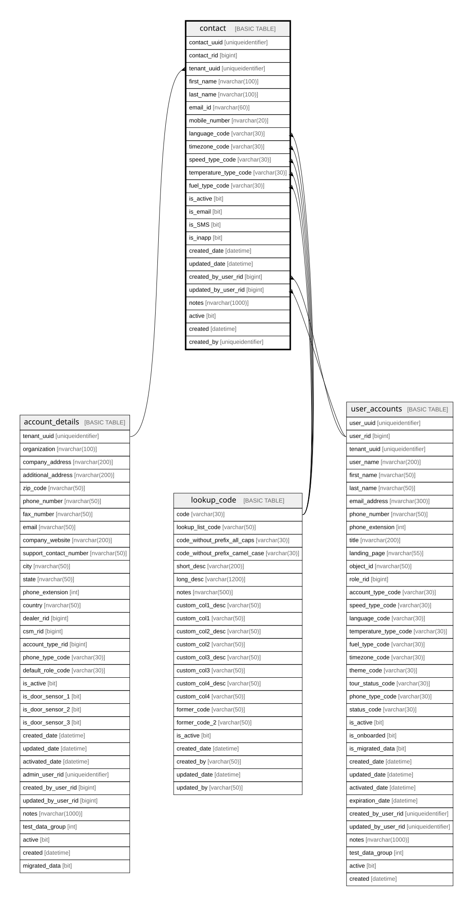

# contact

## Description

the table that stores the details of the contacts

## Columns

| Name | Type | Default | Nullable | Children | Parents | Comment |
| ---- | ---- | ------- | -------- | -------- | ------- | ------- |
| contact_uuid | uniqueidentifier | (newsequentialid()) | false |  |  | Unique identifier for the record, a unique nonclustered key for the table. Must be a SQL-sortable UUIDv7. , Data type = uniqueidentifier, Nullable = No |
| contact_rid | bigint |  | false |  |  | Unique RowID for the record, part of composite primary key for the table after tenant_uuid, a unique clustered key for the table, Data type = bigint, Nullable = No |
| tenant_uuid | uniqueidentifier |  | false |  | [account_details](account_details.md) | the uniqueidentifier for the tenant/customer.  Used as a partitioning key., Data type = uniqueidentifier, Nullable = No, References = [dbo].[account_details].[tenant_uuid] |
| first_name | nvarchar(100) |  | true |  |  | the first name of the contact, Data type = nvarchar(100), Nullable = Yes |
| last_name | nvarchar(100) |  | true |  |  | the last name of the contact, Data type = nvarchar(100), Nullable = Yes |
| email_id | nvarchar(60) |  | true |  |  | the rid (integer identity) which might be deprecated and replaced by the uuid, Data type = nvarchar(60), Nullable = Yes |
| mobile_number | nvarchar(20) |  | true |  |  | the mobile phone number, Data type = nvarchar(20), Nullable = Yes |
| language_code | varchar(30) | ('LNG_ENUS') | false |  | [lookup_code](lookup_code.md) | see lookup.code for information about these values, Data type = varchar(30), Nullable = No, References = [dbo].[lookup_code].[code] |
| timezone_code | varchar(30) | ('TMZ_AMERICA_DETROIT') | false |  | [lookup_code](lookup_code.md) | see lookup.code for information about these values, Data type = varchar(30), Nullable = No, References = [dbo].[lookup_code].[code] |
| speed_type_code | varchar(30) | ('SPT_MPH') | false |  | [lookup_code](lookup_code.md) | see lookup.code for information about these values, Data type = varchar(30), Nullable = No, References = [dbo].[lookup_code].[code] |
| temperature_type_code | varchar(30) | ('TMP_FAHRENHEIT') | false |  | [lookup_code](lookup_code.md) | see lookup.code for information about these values, Data type = varchar(30), Nullable = No, References = [dbo].[lookup_code].[code] |
| fuel_type_code | varchar(30) | ('FLT_U_S_GALLONS') | false |  | [lookup_code](lookup_code.md) | see lookup.code for information about these values, Data type = varchar(30), Nullable = No, References = [dbo].[lookup_code].[code] |
| is_active | bit | ((1)) | false |  |  | the record is active, Data type = bit, Nullable = No |
| is_email | bit | ((0)) | false |  |  | is the record email, Data type = bit, Nullable = No |
| is_SMS | bit | ((0)) | false |  |  | is the record SMS, Data type = bit, Nullable = No |
| is_inapp | bit | ((0)) | false |  |  | is the record inapp, Data type = bit, Nullable = No |
| created_date | datetime | (getdate()) | false |  |  | the date the record was created, Data type = datetime, Nullable = No |
| updated_date | datetime |  | true |  |  | the date the record was updated or created, Data type = datetime, Nullable = Yes |
| created_by_user_rid | bigint |  | true |  | [user_accounts](user_accounts.md) |  |
| updated_by_user_rid | bigint |  | true |  | [user_accounts](user_accounts.md) |  |
| notes | nvarchar(1000) |  | true |  |  | Optional notes and comments about this record, Data type = nvarchar(1000), Nullable = Yes |
| active | bit | ((1)) | true |  |  | DEPRECATED - replaced by is_active, Data type = bit, Nullable = Yes |
| created | datetime | (getdate()) | true |  |  | DEPRECATED - replaced by created_date, Data type = datetime, Nullable = Yes |
| created_by | uniqueidentifier |  | true |  |  | who created the contact, Data type = uniqueidentifier, Nullable = Yes |

## Constraints

| Name | Type | Definition |
| ---- | ---- | ---------- |
| pk_contact_tenant_uuid_contact_rid | PRIMARY KEY | CLUSTERED, unique, part of a PRIMARY KEY constraint, [ tenant_uuid, contact_rid ] |
| uk_contact_uuid | UNIQUE | NONCLUSTERED, unique, part of a UNIQUE constraint, [ contact_uuid ] |
| uk_contact_rid | UNIQUE | NONCLUSTERED, unique, part of a UNIQUE constraint, [ contact_rid ] |
| fk_contact_created_by_user_rid | FOREIGN KEY | FOREIGN KEY(created_by_user_rid) REFERENCES user_accounts(user_rid) ON UPDATE NO_ACTION ON DELETE NO_ACTION |
| fk_contact_fuel_type_code | FOREIGN KEY | FOREIGN KEY(fuel_type_code) REFERENCES lookup_code(code) ON UPDATE NO_ACTION ON DELETE NO_ACTION |
| fk_contact_language_code | FOREIGN KEY | FOREIGN KEY(language_code) REFERENCES lookup_code(code) ON UPDATE NO_ACTION ON DELETE NO_ACTION |
| fk_contact_speed_type_code | FOREIGN KEY | FOREIGN KEY(speed_type_code) REFERENCES lookup_code(code) ON UPDATE NO_ACTION ON DELETE NO_ACTION |
| fk_contact_temperature_type_code | FOREIGN KEY | FOREIGN KEY(temperature_type_code) REFERENCES lookup_code(code) ON UPDATE NO_ACTION ON DELETE NO_ACTION |
| fk_contact_tenant_uuid | FOREIGN KEY | FOREIGN KEY(tenant_uuid) REFERENCES account_details(tenant_uuid) ON UPDATE NO_ACTION ON DELETE NO_ACTION |
| fk_contact_timezone_code | FOREIGN KEY | FOREIGN KEY(timezone_code) REFERENCES lookup_code(code) ON UPDATE NO_ACTION ON DELETE NO_ACTION |
| fk_contact_updated_by_user_rid | FOREIGN KEY | FOREIGN KEY(updated_by_user_rid) REFERENCES user_accounts(user_rid) ON UPDATE NO_ACTION ON DELETE NO_ACTION |

## Indexes

| Name | Definition |
| ---- | ---------- |
| pk_contact_tenant_uuid_contact_rid | CLUSTERED, unique, part of a PRIMARY KEY constraint, [ tenant_uuid, contact_rid ] |
| uk_contact_uuid | NONCLUSTERED, unique, part of a UNIQUE constraint, [ contact_uuid ] |
| uk_contact_rid | NONCLUSTERED, unique, part of a UNIQUE constraint, [ contact_rid ] |
| ix_fk_contact_temperature_type_code | NONCLUSTERED, [ temperature_type_code ] |
| ix_fk_contact_updated_by_user_rid | NONCLUSTERED, [ updated_by_user_rid ] |
| ix_fk_contact_timezone_code | NONCLUSTERED, [ timezone_code ] |
| ix_fk_contact_tenant_uuid | NONCLUSTERED, [ tenant_uuid ] |
| ix_fk_contact_fuel_type_code | NONCLUSTERED, [ fuel_type_code ] |
| ix_fk_contact_language_code | NONCLUSTERED, [ language_code ] |
| ix_fk_contact_speed_type_code | NONCLUSTERED, [ speed_type_code ] |
| ix_fk_contact_created_by_user_rid | NONCLUSTERED, [ created_by_user_rid ] |

## Relations

---

> Generated by [tbls](https://github.com/k1LoW/tbls)
