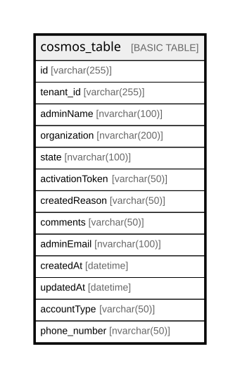

# cosmos_table

## Columns

| Name | Type | Default | Nullable | Children | Parents | Comment |
| ---- | ---- | ------- | -------- | -------- | ------- | ------- |
| id | varchar(255) | (newid()) | true |  |  |  |
| tenant_id | varchar(255) |  | true |  |  |  |
| adminName | nvarchar(100) |  | true |  |  |  |
| organization | nvarchar(200) |  | true |  |  |  |
| state | nvarchar(100) |  | true |  |  |  |
| activationToken | varchar(50) | ('NULL') | true |  |  |  |
| createdReason | varchar(50) | ('V1_migrated_data') | true |  |  |  |
| comments | varchar(50) | ('V1_migrated_data') | true |  |  |  |
| adminEmail | nvarchar(100) |  | true |  |  |  |
| createdAt | datetime | (getdate()) | true |  |  |  |
| updatedAt | datetime | (getdate()) | true |  |  |  |
| accountType | varchar(50) |  | true |  |  |  |
| phone_number | nvarchar(50) | ('0000000000') | true |  |  |  |

## Relations

---

> Generated by [tbls](https://github.com/k1LoW/tbls)
