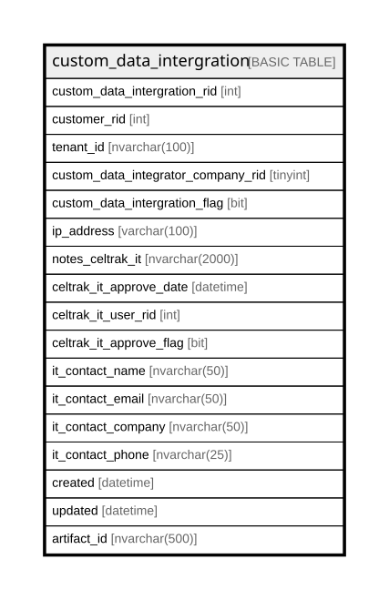

# custom_data_intergration

## Columns

| Name | Type | Default | Nullable | Children | Parents | Comment |
| ---- | ---- | ------- | -------- | -------- | ------- | ------- |
| custom_data_intergration_rid | int |  | false |  |  |  |
| customer_rid | int |  | true |  |  |  |
| tenant_id | nvarchar(100) |  | false |  |  |  |
| custom_data_integrator_company_rid | tinyint |  | true |  |  |  |
| custom_data_intergration_flag | bit |  | true |  |  |  |
| ip_address | varchar(100) |  | true |  |  |  |
| notes_celtrak_it | nvarchar(2000) |  | true |  |  |  |
| celtrak_it_approve_date | datetime |  | true |  |  |  |
| celtrak_it_user_rid | int |  | true |  |  |  |
| celtrak_it_approve_flag | bit |  | true |  |  |  |
| it_contact_name | nvarchar(50) |  | true |  |  |  |
| it_contact_email | nvarchar(50) |  | true |  |  |  |
| it_contact_company | nvarchar(50) |  | true |  |  |  |
| it_contact_phone | nvarchar(25) |  | true |  |  |  |
| created | datetime | (getdate()) | true |  |  |  |
| updated | datetime |  | true |  |  |  |
| artifact_id | nvarchar(500) |  | true |  |  |  |

## Constraints

| Name | Type | Definition |
| ---- | ---- | ---------- |
| PK_custom_data_intergration | PRIMARY KEY | NONCLUSTERED, unique, part of a PRIMARY KEY constraint, [ custom_data_intergration_rid ] |

## Indexes

| Name | Definition |
| ---- | ---------- |
| PK_custom_data_intergration | NONCLUSTERED, unique, part of a PRIMARY KEY constraint, [ custom_data_intergration_rid ] |

## Relations

---

> Generated by [tbls](https://github.com/k1LoW/tbls)
