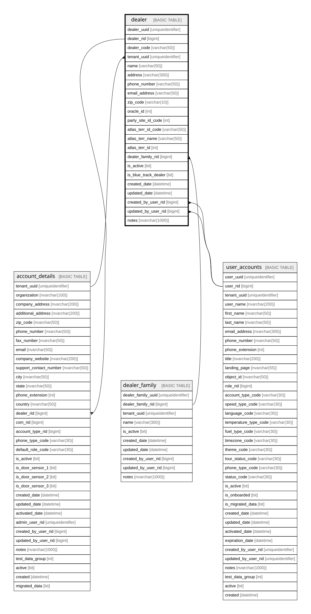

# dealer

## Description

this table stores dealer information

## Columns

| Name | Type | Default | Nullable | Children | Parents | Comment |
| ---- | ---- | ------- | -------- | -------- | ------- | ------- |
| dealer_uuid | uniqueidentifier | (newsequentialid()) | false |  |  | Unique identifier for the record, a unique nonclustered key for the table. Must be a SQL-sortable UUIDv7. , Data type = uniqueidentifier, Nullable = No |
| dealer_rid | bigint |  | false | [account_details](account_details.md) |  | Unique RowID for the record, part of composite primary key for the table after tenant_uuid, a unique clustered key for the table, Data type = bigint, Nullable = No |
| dealer_code | varchar(50) |  | true |  |  | Key used to distinguish actual dealer: ex T2835001. hz_cust_site_uses_all.attribute15. Also same as loc_id in Atlas, how we would bridge tables to get info from atlas, Data type = varchar(50), Nullable = Yes |
| tenant_uuid | uniqueidentifier |  | false |  | [account_details](account_details.md) | The customer/tenant also used as the partition key, Data type = uniqueidentifier, Nullable = No, References = [dbo].[account_details].[tenant_uuid] |
| name | varchar(50) |  | true |  |  | Name that will display to customers in TracKing. Want a clean version of the name which would be found in Atlas: geo.dealer_locations.loc_name, Data type = varchar(50), Nullable = Yes |
| address | varchar(300) |  | true |  |  | Atlas, address field from geo.dealer_locations.address, Data type = varchar(300), Nullable = Yes |
| phone_number | varchar(50) |  | true |  |  | phone number for individual dealer, not central phone number. Would come from the LOC_USER_CONTACT_POINTS table in dealer portal.  , Data type = varchar(50), Nullable = Yes |
| email_address | varchar(50) |  | true |  |  | email address for individual dealer, not central email address. Would come from the LOC_USER_CONTACT_POINTS table in dealer portal.  , Data type = varchar(50), Nullable = Yes |
| zip_code | varchar(10) |  | true |  |  | ar.hz_locations.postal_code, Data type = varchar(10), Nullable = Yes |
| oracle_id | int |  | true |  |  | Oracle (R12) Account Number : apps.hz_cust_acct_sites_all.cust_acct_side_id, Data type = int, Nullable = Yes |
| party_site_id_code | int |  | true |  |  | key used to connect to Salesforce. ar.hz_cust_acct_sites_all.party_site_id, Data type = int, Nullable = Yes |
| atlas_terr_id_code | varchar(50) |  | true |  |  | geo.dealer_territories.terr_id, Data type = varchar(50), Nullable = Yes |
| atlas_terr_name | varchar(50) |  | true |  |  | geo.dealer_territories.terr_name, Data type = varchar(50), Nullable = Yes |
| atlas_terr_id | int |  | true |  |  | Atlas, Data type = int, Nullable = Yes |
| dealer_family_rid | bigint |  | true |  | [dealer_family](dealer_family.md) | References column dealer_family_rid on table dealer_family, Data type = bigint, Nullable = Yes, References = [dbo].[dealer_family].[dealer_family_rid] |
| is_active | bit | ((1)) | false |  |  | is the dealer active yes or no, Data type = bit, Nullable = No |
| is_blue_track_dealer | bit |  | true |  |  | geo.dealer_locations.blue_track, Data type = bit, Nullable = Yes |
| created_date | datetime | (getdate()) | false |  |  | when the record was created, Data type = datetime, Nullable = No |
| updated_date | datetime |  | true |  |  | when the record was updated, Data type = datetime, Nullable = Yes |
| created_by_user_rid | bigint |  | true |  | [user_accounts](user_accounts.md) |  |
| updated_by_user_rid | bigint |  | true |  | [user_accounts](user_accounts.md) |  |
| notes | nvarchar(1000) |  | true |  |  | Optional notes and comments about this record, Data type = nvarchar(2000), Nullable = Yes |

## Constraints

| Name | Type | Definition |
| ---- | ---- | ---------- |
| pk_dealer_tenant_uuid_dealer_rid | PRIMARY KEY | CLUSTERED, unique, part of a PRIMARY KEY constraint, [ tenant_uuid, dealer_rid ] |
| uk_dealer_uuid | UNIQUE | NONCLUSTERED, unique, part of a UNIQUE constraint, [ dealer_uuid ] |
| uk_dealer_rid | UNIQUE | NONCLUSTERED, unique, part of a UNIQUE constraint, [ dealer_rid ] |
| fk_dealer_created_by_user_rid | FOREIGN KEY | FOREIGN KEY(created_by_user_rid) REFERENCES user_accounts(user_rid) ON UPDATE NO_ACTION ON DELETE NO_ACTION |
| fk_dealer_dealer_family_rid | FOREIGN KEY | FOREIGN KEY(dealer_family_rid) REFERENCES dealer_family(dealer_family_rid) ON UPDATE NO_ACTION ON DELETE NO_ACTION |
| fk_dealer_tenant_uuid | FOREIGN KEY | FOREIGN KEY(tenant_uuid) REFERENCES account_details(tenant_uuid) ON UPDATE NO_ACTION ON DELETE NO_ACTION |
| fk_dealer_updated_by_user_rid | FOREIGN KEY | FOREIGN KEY(updated_by_user_rid) REFERENCES user_accounts(user_rid) ON UPDATE NO_ACTION ON DELETE NO_ACTION |

## Indexes

| Name | Definition |
| ---- | ---------- |
| pk_dealer_tenant_uuid_dealer_rid | CLUSTERED, unique, part of a PRIMARY KEY constraint, [ tenant_uuid, dealer_rid ] |
| uk_dealer_uuid | NONCLUSTERED, unique, part of a UNIQUE constraint, [ dealer_uuid ] |
| uk_dealer_rid | NONCLUSTERED, unique, part of a UNIQUE constraint, [ dealer_rid ] |
| ix_fk_dealer_updated_by_user_rid | NONCLUSTERED, [ updated_by_user_rid ] |
| ix_fk_dealer_dealer_family_rid | NONCLUSTERED, [ dealer_family_rid ] |
| ix_fk_dealer_tenant_uuid | NONCLUSTERED, [ tenant_uuid ] |
| ix_fk_dealer_created_by_user_rid | NONCLUSTERED, [ created_by_user_rid ] |

## Relations

---

> Generated by [tbls](https://github.com/k1LoW/tbls)
