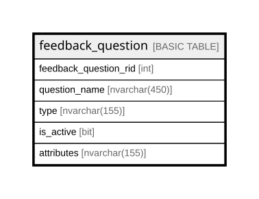

# feedback_question

## Columns

| Name | Type | Default | Nullable | Children | Parents | Comment |
| ---- | ---- | ------- | -------- | -------- | ------- | ------- |
| feedback_question_rid | int |  | false |  |  | Unique RowID for the record, part of composite primary key for the table after tenant_uuid, a unique clustered key for the table, Data type = int, Nullable = No |
| question_name | nvarchar(450) |  | false |  |  |  |
| type | nvarchar(155) |  | false |  |  |  |
| is_active | bit | ((1)) | false |  |  | the record is active, Data type = bit, Nullable = No |
| attributes | nvarchar(155) |  | true |  |  |  |

## Constraints

| Name | Type | Definition |
| ---- | ---- | ---------- |
| PK_feedback_question | PRIMARY KEY | CLUSTERED, unique, part of a PRIMARY KEY constraint, [ feedback_question_rid ] |

## Indexes

| Name | Definition |
| ---- | ---------- |
| PK_feedback_question | CLUSTERED, unique, part of a PRIMARY KEY constraint, [ feedback_question_rid ] |

## Relations

---

> Generated by [tbls](https://github.com/k1LoW/tbls)
