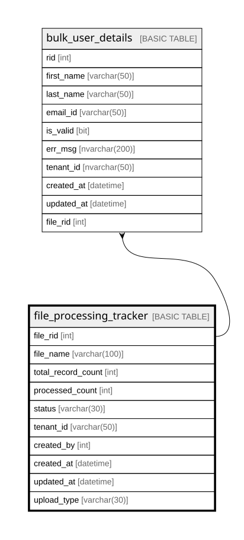

# file_processing_tracker

## Columns

| Name | Type | Default | Nullable | Children | Parents | Comment |
| ---- | ---- | ------- | -------- | -------- | ------- | ------- |
| file_rid | int |  | false | [bulk_user_details](bulk_user_details.md) |  |  |
| file_name | varchar(100) |  | false |  |  |  |
| total_record_count | int |  | true |  |  |  |
| processed_count | int |  | true |  |  |  |
| status | varchar(30) |  | true |  |  |  |
| tenant_id | varchar(50) |  | true |  |  |  |
| created_by | int |  | true |  |  |  |
| created_at | datetime |  | true |  |  |  |
| updated_at | datetime |  | true |  |  |  |
| upload_type | varchar(30) |  | false |  |  |  |

## Constraints

| Name | Type | Definition |
| ---- | ---- | ---------- |
| PK_file_processing_tracker | PRIMARY KEY | CLUSTERED, unique, part of a PRIMARY KEY constraint, [ file_rid ] |

## Indexes

| Name | Definition |
| ---- | ---------- |
| PK_file_processing_tracker | CLUSTERED, unique, part of a PRIMARY KEY constraint, [ file_rid ] |

## Relations

---

> Generated by [tbls](https://github.com/k1LoW/tbls)
