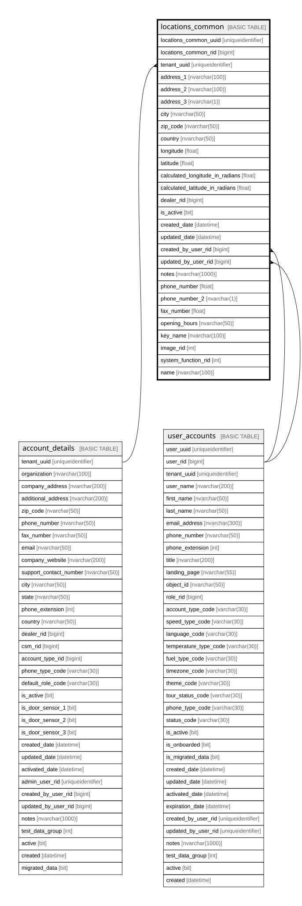

# locations_common

## Description

Used for Location-Related and Map Processes

## Columns

| Name | Type | Default | Nullable | Children | Parents | Comment |
| ---- | ---- | ------- | -------- | -------- | ------- | ------- |
| locations_common_uuid | uniqueidentifier | (newsequentialid()) | false |  |  | Unique identifier for the record, a unique nonclustered key for the table. Must be a SQL-sortable UUIDv7. , Data type = uniqueidentifier, Nullable = No |
| locations_common_rid | bigint |  | false |  |  | Unique RowID for the record, part of composite primary key for the table after tenant_uuid, a unique clustered key for the table, Data type = bigint, Nullable = No |
| tenant_uuid | uniqueidentifier |  | false |  | [account_details](account_details.md) | The customer/tenant also used as the partition key, Data type = uniqueidentifier, Nullable = No, References = [dbo].[account_details].[tenant_uuid] |
| address_1 | nvarchar(100) |  | false |  |  |  |
| address_2 | nvarchar(100) |  | true |  |  |  |
| address_3 | nvarchar(1) |  | true |  |  |  |
| city | nvarchar(50) |  | false |  |  |  |
| zip_code | nvarchar(50) |  | true |  |  |  |
| country | nvarchar(50) |  | false |  |  |  |
| longitude | float |  | false |  |  |  |
| latitude | float |  | false |  |  |  |
| calculated_longitude_in_radians | float |  | false |  |  |  |
| calculated_latitude_in_radians | float |  | false |  |  |  |
| dealer_rid | bigint |  | true |  |  | References column dealer_rid on table dealer, Data type = bigint, Nullable = Yes |
| is_active | bit | ((1)) | false |  |  | The record is active, Data type = bit, Nullable = No |
| created_date | datetime | (getdate()) | false |  |  |  |
| updated_date | datetime |  | true |  |  |  |
| created_by_user_rid | bigint |  | true |  | [user_accounts](user_accounts.md) |  |
| updated_by_user_rid | bigint |  | true |  | [user_accounts](user_accounts.md) |  |
| notes | nvarchar(1000) |  | true |  |  | Optional notes and comments about this record, Data type = nvarchar(2000), Nullable = Yes |
| phone_number | float |  | true |  |  |  |
| phone_number_2 | nvarchar(1) |  | true |  |  |  |
| fax_number | float |  | true |  |  |  |
| opening_hours | nvarchar(50) |  | true |  |  |  |
| key_name | nvarchar(100) |  | false |  |  |  |
| image_rid | int |  | false |  |  |  |
| system_function_rid | int |  | true |  |  |  |
| name | nvarchar(100) |  | false |  |  |  |

## Constraints

| Name | Type | Definition |
| ---- | ---- | ---------- |
| pk_locations_common_tenant_uuid_locations_common_rid | PRIMARY KEY | CLUSTERED, unique, part of a PRIMARY KEY constraint, [ tenant_uuid, locations_common_rid ] |
| uk_locations_common_uuid | UNIQUE | NONCLUSTERED, unique, part of a UNIQUE constraint, [ locations_common_uuid ] |
| uk_locations_common_rid | UNIQUE | NONCLUSTERED, unique, part of a UNIQUE constraint, [ locations_common_rid ] |
| fk_locations_common_created_by_user_rid | FOREIGN KEY | FOREIGN KEY(created_by_user_rid) REFERENCES user_accounts(user_rid) ON UPDATE NO_ACTION ON DELETE NO_ACTION |
| fk_locations_common_tenant_uuid | FOREIGN KEY | FOREIGN KEY(tenant_uuid) REFERENCES account_details(tenant_uuid) ON UPDATE NO_ACTION ON DELETE NO_ACTION |
| fk_locations_common_updated_by_user_rid | FOREIGN KEY | FOREIGN KEY(updated_by_user_rid) REFERENCES user_accounts(user_rid) ON UPDATE NO_ACTION ON DELETE NO_ACTION |

## Indexes

| Name | Definition |
| ---- | ---------- |
| pk_locations_common_tenant_uuid_locations_common_rid | CLUSTERED, unique, part of a PRIMARY KEY constraint, [ tenant_uuid, locations_common_rid ] |
| uk_locations_common_uuid | NONCLUSTERED, unique, part of a UNIQUE constraint, [ locations_common_uuid ] |
| uk_locations_common_rid | NONCLUSTERED, unique, part of a UNIQUE constraint, [ locations_common_rid ] |
| ix_fk_locations_common_created_by_user_rid | NONCLUSTERED, [ created_by_user_rid ] |
| ix_fk_locations_common_updated_by_user_rid | NONCLUSTERED, [ updated_by_user_rid ] |
| ix_fk_locations_common_tenant_uuid | NONCLUSTERED, [ tenant_uuid ] |

## Relations

---

> Generated by [tbls](https://github.com/k1LoW/tbls)
