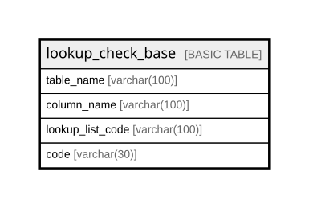

# lookup_check_base

## Columns

| Name | Type | Default | Nullable | Children | Parents | Comment |
| ---- | ---- | ------- | -------- | -------- | ------- | ------- |
| table_name | varchar(100) |  | false |  |  |  |
| column_name | varchar(100) |  | false |  |  |  |
| lookup_list_code | varchar(100) |  | false |  |  |  |
| code | varchar(30) |  | false |  |  |  |

## Relations

---

> Generated by [tbls](https://github.com/k1LoW/tbls)
