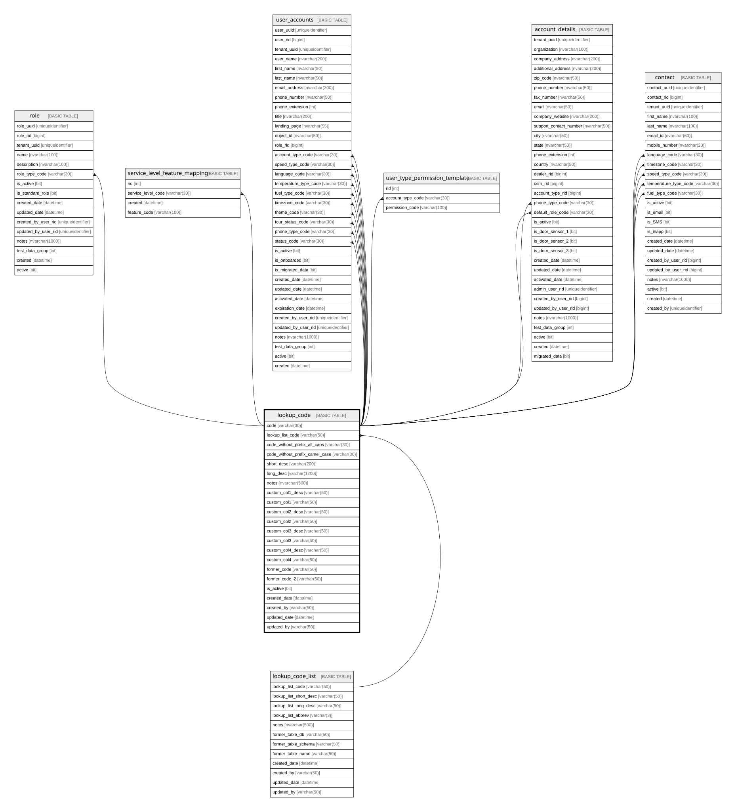

# lookup_code

## Description

used for centralized lookup values and processes

## Columns

| Name | Type | Default | Nullable | Children | Parents | Comment |
| ---- | ---- | ------- | -------- | -------- | ------- | ------- |
| code | varchar(30) |  | false | [role](role.md) [service_level_feature_mapping](service_level_feature_mapping.md) [user_accounts](user_accounts.md) [user_type_permission_template](user_type_permission_template.md) [account_details](account_details.md) [contact](contact.md) |  |  |
| lookup_list_code | varchar(50) |  | false |  | [lookup_code_list](lookup_code_list.md) |  |
| code_without_prefix_all_caps | varchar(30) |  | false |  |  |  |
| code_without_prefix_camel_case | varchar(30) |  | false |  |  |  |
| short_desc | varchar(200) |  | false |  |  |  |
| long_desc | varchar(1200) |  | false |  |  |  |
| notes | nvarchar(500) |  | true |  |  | optional notes and comments about this record, Data type = nvarchar(1000), Nullable = Yes |
| custom_col1_desc | varchar(50) |  | false |  |  |  |
| custom_col1 | varchar(50) |  | false |  |  |  |
| custom_col2_desc | varchar(50) |  | false |  |  |  |
| custom_col2 | varchar(50) |  | false |  |  |  |
| custom_col3_desc | varchar(50) |  | false |  |  |  |
| custom_col3 | varchar(50) |  | false |  |  |  |
| custom_col4_desc | varchar(50) |  | false |  |  |  |
| custom_col4 | varchar(50) |  | false |  |  |  |
| former_code | varchar(50) |  | false |  |  |  |
| former_code_2 | varchar(50) |  | false |  |  |  |
| is_active | bit |  | false |  |  | the record is active, Data type = bit, Nullable = No |
| created_date | datetime | (getutcdate()) | false |  |  |  |
| created_by | varchar(50) | (suser_sname()) | false |  |  |  |
| updated_date | datetime | (getutcdate()) | true |  |  |  |
| updated_by | varchar(50) | (suser_sname()) | true |  |  |  |

## Constraints

| Name | Type | Definition |
| ---- | ---- | ---------- |
| PK_lookup_code | PRIMARY KEY | CLUSTERED, unique, part of a PRIMARY KEY constraint, [ code ] |
| FK_lookup_code | FOREIGN KEY | FOREIGN KEY(lookup_list_code) REFERENCES lookup_code_list(lookup_list_code) ON UPDATE NO_ACTION ON DELETE NO_ACTION |

## Indexes

| Name | Definition |
| ---- | ---------- |
| PK_lookup_code | CLUSTERED, unique, part of a PRIMARY KEY constraint, [ code ] |

## Relations

---

> Generated by [tbls](https://github.com/k1LoW/tbls)
