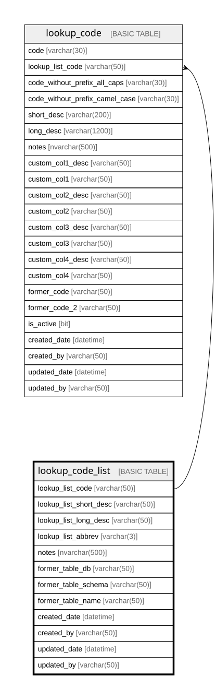

# lookup_code_list

## Description

used for centralized lookup values and processes

## Columns

| Name | Type | Default | Nullable | Children | Parents | Comment |
| ---- | ---- | ------- | -------- | -------- | ------- | ------- |
| lookup_list_code | varchar(50) |  | false | [lookup_code](lookup_code.md) |  |  |
| lookup_list_short_desc | varchar(50) |  | false |  |  |  |
| lookup_list_long_desc | varchar(50) |  | false |  |  |  |
| lookup_list_abbrev | varchar(3) |  | false |  |  |  |
| notes | nvarchar(500) |  | true |  |  | optional notes and comments about this record, Data type = nvarchar(1000), Nullable = Yes |
| former_table_db | varchar(50) |  | true |  |  |  |
| former_table_schema | varchar(50) |  | true |  |  |  |
| former_table_name | varchar(50) |  | true |  |  |  |
| created_date | datetime | (getutcdate()) | false |  |  |  |
| created_by | varchar(50) | (suser_sname()) | false |  |  |  |
| updated_date | datetime | (getutcdate()) | true |  |  |  |
| updated_by | varchar(50) | (suser_sname()) | true |  |  |  |

## Constraints

| Name | Type | Definition |
| ---- | ---- | ---------- |
| PK_lookup_code_list_new | PRIMARY KEY | CLUSTERED, unique, part of a PRIMARY KEY constraint, [ lookup_list_code ] |

## Indexes

| Name | Definition |
| ---- | ---------- |
| PK_lookup_code_list_new | CLUSTERED, unique, part of a PRIMARY KEY constraint, [ lookup_list_code ] |

## Relations

---

> Generated by [tbls](https://github.com/k1LoW/tbls)
