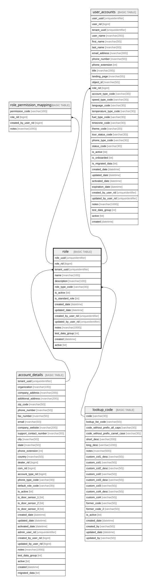

# role

## Description

the table that stores the details of the roles

## Columns

| Name | Type | Default | Nullable | Children | Parents | Comment |
| ---- | ---- | ------- | -------- | -------- | ------- | ------- |
| role_uuid | uniqueidentifier | (newsequentialid()) | false |  |  | the uuid of the role, Data type = uniqueidentifier, Nullable = No |
| role_rid | bigint |  | false | [role_permission_mapping](role_permission_mapping.md) [user_accounts](user_accounts.md) |  | the rid (integer identity) which might be deprecated and replaced by the uuid, Data type = bigint, Nullable = No |
| tenant_uuid | uniqueidentifier |  | false |  | [account_details](account_details.md) | the uniqueidentifier for the tenant/customer.  Used as a partitioning key., Data type = uniqueidentifier, Nullable = No, References = [dbo].[account_details].[tenant_uuid] |
| name | nvarchar(100) |  | false |  |  | the short description of the record, Data type = nvarchar(200), Nullable = No |
| description | nvarchar(100) |  | false |  |  | the long description of the record, Data type = nvarchar(200), Nullable = No |
| role_type_code | varchar(30) |  | false |  | [lookup_code](lookup_code.md) | see lookup.code for information about these values, Data type = varchar(30), Nullable = No, References = [dbo].[lookup_code].[code] |
| is_active | bit | ((1)) | false |  |  | the record is active, Data type = bit, Nullable = No |
| is_standard_role | bit | ((1)) | false |  |  | is the record standard role, Data type = bit, Nullable = No |
| created_date | datetime | (getdate()) | false |  |  | the date the record was created, Data type = datetime, Nullable = No |
| updated_date | datetime | (getdate()) | false |  |  | the date the record was updated or created, Data type = datetime, Nullable = No |
| created_by_user_rid | uniqueidentifier |  | true |  |  |  |
| updated_by_user_rid | uniqueidentifier |  | true |  |  |  |
| notes | nvarchar(1000) |  | true |  |  | optional notes and comments about this record, Data type = nvarchar(2000), Nullable = Yes |
| test_data_group | int |  | true |  |  | used for the Dev test data process, Data type = int, Nullable = Yes |
| created | datetime | (getdate()) | false |  |  | deprecated - replaced by created_date, Data type = datetime, Nullable = No |
| active | bit |  | false |  |  | deprecated - replaced by is_active, Data type = bit, Nullable = No |

## Constraints

| Name | Type | Definition |
| ---- | ---- | ---------- |
| pk_role_tenant_uuid_role_rid | PRIMARY KEY | CLUSTERED, unique, part of a PRIMARY KEY constraint, [ tenant_uuid, role_rid ] |
| uk_role_uuid | UNIQUE | NONCLUSTERED, unique, part of a UNIQUE constraint, [ role_uuid ] |
| uk_role_rid | UNIQUE | NONCLUSTERED, unique, part of a UNIQUE constraint, [ role_rid ] |
| fk_role_role_type_code | FOREIGN KEY | FOREIGN KEY(role_type_code) REFERENCES lookup_code(code) ON UPDATE NO_ACTION ON DELETE NO_ACTION |
| fk_role_tenant_uuid | FOREIGN KEY | FOREIGN KEY(tenant_uuid) REFERENCES account_details(tenant_uuid) ON UPDATE NO_ACTION ON DELETE NO_ACTION |

## Indexes

| Name | Definition |
| ---- | ---------- |
| pk_role_tenant_uuid_role_rid | CLUSTERED, unique, part of a PRIMARY KEY constraint, [ tenant_uuid, role_rid ] |
| uk_role_uuid | NONCLUSTERED, unique, part of a UNIQUE constraint, [ role_uuid ] |
| uk_role_rid | NONCLUSTERED, unique, part of a UNIQUE constraint, [ role_rid ] |
| ix_fk_role_role_type_code | NONCLUSTERED, [ role_type_code ] |
| ix_fk_role_tenant_uuid | NONCLUSTERED, [ tenant_uuid ] |

## Relations

---

> Generated by [tbls](https://github.com/k1LoW/tbls)
