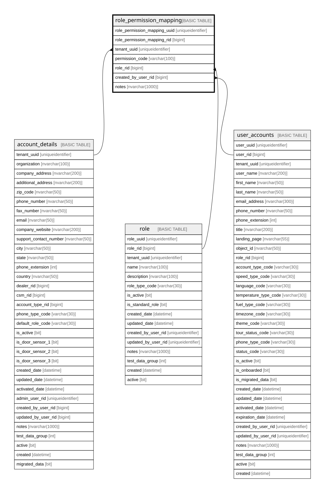

# role_permission_mapping

## Description

MANY-TO-MANY relationship mapping between Role and Permission

## Columns

| Name | Type | Default | Nullable | Children | Parents | Comment |
| ---- | ---- | ------- | -------- | -------- | ------- | ------- |
| permission_code | varchar(100) |  | false |  |  | MANY-TO-MANY composite primary key field for Role and Permission, Data type = varchar(100), Nullable = No |
| role_rid | bigint |  | false |  | [role](role.md) | MANY-TO-MANY composite primary key field for Role and Permission, Data type = bigint, Nullable = No, References = [dbo].[role].[role_rid] |
| created_by_user_rid | bigint |  | true |  | [user_accounts](user_accounts.md) |  |
| notes | nvarchar(1000) |  | true |  |  | Optional notes and comments about this record, Data type = nvarchar(1000), Nullable = Yes |

## Constraints

| Name | Type | Definition |
| ---- | ---- | ---------- |
| pk_role_permission_mapping_permission_code_role_rid | PRIMARY KEY | CLUSTERED, unique, part of a PRIMARY KEY constraint, [ permission_code, role_rid ] |
| fk_role_permission_mapping_created_by_user_rid | FOREIGN KEY | FOREIGN KEY(created_by_user_rid) REFERENCES user_accounts(user_rid) ON UPDATE NO_ACTION ON DELETE NO_ACTION |
| fk_role_permission_mapping_user_rid | FOREIGN KEY | FOREIGN KEY(role_rid) REFERENCES role(role_rid) ON UPDATE NO_ACTION ON DELETE NO_ACTION |

## Indexes

| Name | Definition |
| ---- | ---------- |
| pk_role_permission_mapping_permission_code_role_rid | CLUSTERED, unique, part of a PRIMARY KEY constraint, [ permission_code, role_rid ] |
| ix_fk_role_permission_mapping_created_by_user_rid | NONCLUSTERED, [ created_by_user_rid ] |
| ix_fk_role_permission_mapping_user_rid | NONCLUSTERED, [ role_rid ] |

## Relations

---

> Generated by [tbls](https://github.com/k1LoW/tbls)
