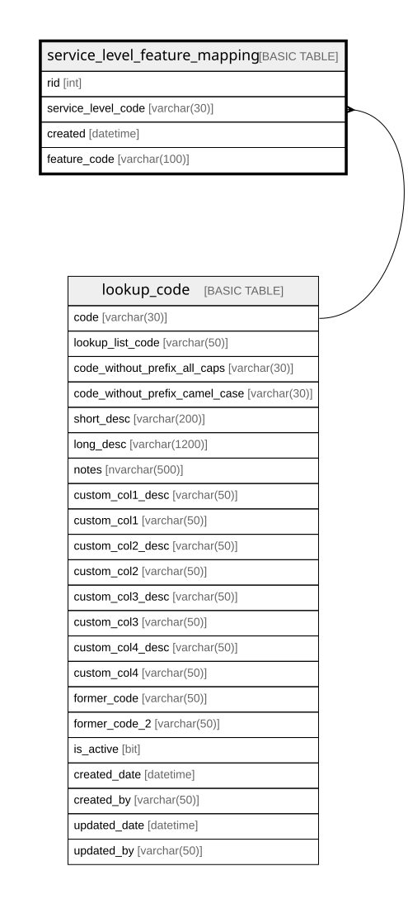

# service_level_feature_mapping

## Columns

| Name | Type | Default | Nullable | Children | Parents | Comment |
| ---- | ---- | ------- | -------- | -------- | ------- | ------- |
| rid | int |  | false |  |  |  |
| service_level_code | varchar(30) |  | false |  | [lookup_code](lookup_code.md) | a lookup to the main lookup_code table, Data type = varchar(30), Nullable = No, References = [dbo].[lookup_code].[code] |
| created | datetime | (getdate()) | false |  |  | DEPRECATED - replaced by created_date, Data type = datetime, Nullable = No |
| feature_code | varchar(100) |  | false |  |  |  |

## Constraints

| Name | Type | Definition |
| ---- | ---- | ---------- |
| PK_service_level_feature_mapping | PRIMARY KEY | CLUSTERED, unique, part of a PRIMARY KEY constraint, [ rid ] |
| FK_service_level_feature_mapping_service_level | FOREIGN KEY | FOREIGN KEY(service_level_code) REFERENCES lookup_code(code) ON UPDATE NO_ACTION ON DELETE NO_ACTION |

## Indexes

| Name | Definition |
| ---- | ---------- |
| PK_service_level_feature_mapping | CLUSTERED, unique, part of a PRIMARY KEY constraint, [ rid ] |
| ix_service_level_feature_mapping_service_level_code | NONCLUSTERED, [ service_level_code ] |

## Relations

---

> Generated by [tbls](https://github.com/k1LoW/tbls)
