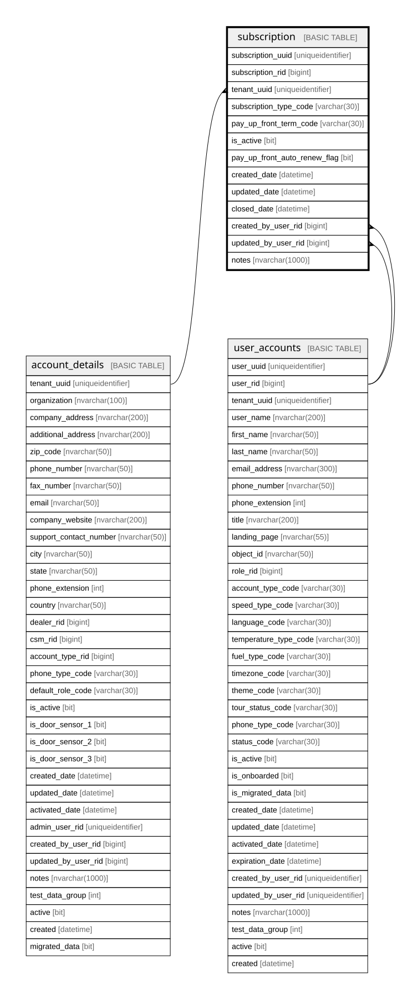

# subscription

## Columns

| Name | Type | Default | Nullable | Children | Parents | Comment |
| ---- | ---- | ------- | -------- | -------- | ------- | ------- |
| subscription_uuid | uniqueidentifier | (newsequentialid()) | false |  |  |  |
| subscription_rid | bigint |  | false |  |  |  |
| tenant_uuid | uniqueidentifier |  | false |  | [account_details](account_details.md) | the customer/tenant also used as the partition key, Data type = uniqueidentifier, Nullable = No, References = [dbo].[account_details].[tenant_uuid] |
| subscription_type_code | varchar(30) |  | false |  |  |  |
| pay_up_front_term_code | varchar(30) |  | true |  |  |  |
| is_active | bit | ((1)) | false |  |  | the record is active, Data type = bit, Nullable = No |
| pay_up_front_auto_renew_flag | bit |  | false |  |  |  |
| created_date | datetime | (getdate()) | false |  |  |  |
| updated_date | datetime |  | true |  |  |  |
| closed_date | datetime |  | true |  |  |  |
| created_by_user_rid | bigint |  | true |  | [user_accounts](user_accounts.md) |  |
| updated_by_user_rid | bigint |  | true |  | [user_accounts](user_accounts.md) |  |
| notes | nvarchar(1000) |  | true |  |  | optional notes and comments about this record, Data type = nvarchar(2000), Nullable = Yes |

## Constraints

| Name | Type | Definition |
| ---- | ---- | ---------- |
| pk_subscription_tenant_uuid_subscription_rid | PRIMARY KEY | CLUSTERED, unique, part of a PRIMARY KEY constraint, [ tenant_uuid, subscription_rid ] |
| uk_subscription_uuid | UNIQUE | NONCLUSTERED, unique, part of a UNIQUE constraint, [ subscription_uuid ] |
| uk_subscription_rid | UNIQUE | NONCLUSTERED, unique, part of a UNIQUE constraint, [ subscription_rid ] |
| fk_subscription_created_by_user_rid | FOREIGN KEY | FOREIGN KEY(created_by_user_rid) REFERENCES user_accounts(user_rid) ON UPDATE NO_ACTION ON DELETE NO_ACTION |
| fk_subscription_tenant_uuid | FOREIGN KEY | FOREIGN KEY(tenant_uuid) REFERENCES account_details(tenant_uuid) ON UPDATE NO_ACTION ON DELETE NO_ACTION |
| fk_subscription_updated_by_user_rid | FOREIGN KEY | FOREIGN KEY(updated_by_user_rid) REFERENCES user_accounts(user_rid) ON UPDATE NO_ACTION ON DELETE NO_ACTION |

## Indexes

| Name | Definition |
| ---- | ---------- |
| pk_subscription_tenant_uuid_subscription_rid | CLUSTERED, unique, part of a PRIMARY KEY constraint, [ tenant_uuid, subscription_rid ] |
| uk_subscription_uuid | NONCLUSTERED, unique, part of a UNIQUE constraint, [ subscription_uuid ] |
| uk_subscription_rid | NONCLUSTERED, unique, part of a UNIQUE constraint, [ subscription_rid ] |
| ix_fk_subscription_tenant_uuid | NONCLUSTERED, [ tenant_uuid ] |
| ix_fk_subscription_updated_by_user_rid | NONCLUSTERED, [ updated_by_user_rid ] |
| ix_fk_subscription_created_by_user_rid | NONCLUSTERED, [ created_by_user_rid ] |

## Relations

---

> Generated by [tbls](https://github.com/k1LoW/tbls)
