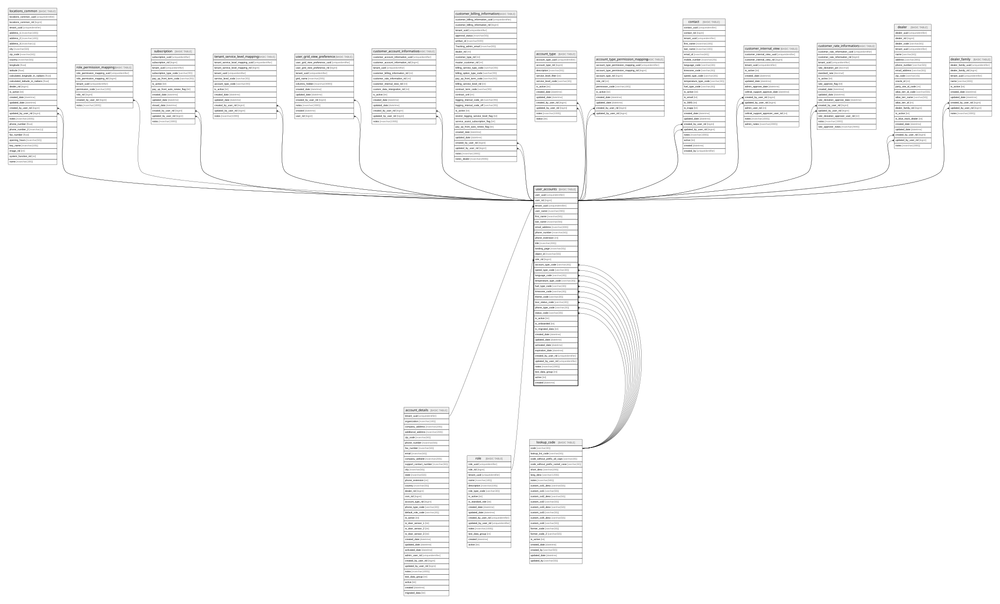

# user_accounts

## Description

the table that stores the details of the users

## Columns

| Name | Type | Default | Nullable | Children | Parents | Comment |
| ---- | ---- | ------- | -------- | -------- | ------- | ------- |
| user_uuid | uniqueidentifier | (newsequentialid()) | false |  |  | the uuid of the user, Data type = uniqueidentifier, Nullable = No |
| user_rid | bigint |  | false | [locations_common](locations_common.md) [role_permission_mapping](role_permission_mapping.md) [subscription](subscription.md) [tenant_service_level_mapping](tenant_service_level_mapping.md) [user_grid_view_preference](user_grid_view_preference.md) [account_type](account_type.md) [account_type_permission_mapping](account_type_permission_mapping.md) [contact](contact.md) [customer_account_information](customer_account_information.md) [customer_billing_information](customer_billing_information.md) [customer_internal_view](customer_internal_view.md) [customer_rate_information](customer_rate_information.md) [dealer](dealer.md) [dealer_family](dealer_family.md) |  | the rid (integer identity) which might be deprecated and replaced by the uuid, Data type = bigint, Nullable = No |
| tenant_uuid | uniqueidentifier |  | false |  | [account_details](account_details.md) | the uniqueidentifier for the tenant/customer.  Used as a partitioning key., Data type = uniqueidentifier, Nullable = No, References = [dbo].[account_details].[tenant_uuid] |
| user_name | nvarchar(200) |  | true |  |  | the user name of the user, Data type = nvarchar(400), Nullable = Yes |
| first_name | nvarchar(50) | ('Tracking') | false |  |  | the first name of the user, Data type = nvarchar(100), Nullable = No |
| last_name | nvarchar(50) | ('User') | false |  |  | the last name of the user, Data type = nvarchar(100), Nullable = No |
| email_address | nvarchar(300) |  | false |  |  | the email address, Data type = nvarchar(600), Nullable = No |
| phone_number | nvarchar(50) |  | true |  |  | the phone number, Data type = nvarchar(100), Nullable = Yes |
| phone_extension | int |  | true |  |  | the extension of the phone number, Data type = int, Nullable = Yes |
| title | nvarchar(200) |  | true |  |  | the job title of the user, Data type = nvarchar(400), Nullable = Yes |
| landing_page | nvarchar(55) | ('DEFAULT') | false |  |  | the page on the UI where the user should land when signing on to the website, Data type = nvarchar(110), Nullable = No |
| object_id | nvarchar(50) |  | true |  |  | the Microsoft Entra ID for the user, Data type = nvarchar(100), Nullable = Yes |
| role_rid | bigint | ((1)) | true |  | [role](role.md) | the rid (integer identity) which might be deprecated and replaced by the uuid, Data type = bigint, Nullable = Yes, References = [dbo].[role].[role_rid] |
| account_type_code | varchar(30) | ('ACT_CUSTOMER') | false |  | [lookup_code](lookup_code.md) | see lookup.code for information about these values, Data type = varchar(30), Nullable = No, References = [dbo].[lookup_code].[code] |
| speed_type_code | varchar(30) | ('SPT_MPH') | false |  | [lookup_code](lookup_code.md) | see lookup.code for information about these values, Data type = varchar(30), Nullable = No, References = [dbo].[lookup_code].[code] |
| language_code | varchar(30) | ('ENUS') | false |  | [lookup_code](lookup_code.md) | see lookup.code for information about these values, Data type = varchar(30), Nullable = No, References = [dbo].[lookup_code].[code] |
| temperature_type_code | varchar(30) | ('TMP_FAHRENHEIT') | false |  | [lookup_code](lookup_code.md) | see lookup.code for information about these values, Data type = varchar(30), Nullable = No, References = [dbo].[lookup_code].[code] |
| fuel_type_code | varchar(30) | ('FLT_U_S_GALLONS') | false |  | [lookup_code](lookup_code.md) | see lookup.code for information about these values, Data type = varchar(30), Nullable = No, References = [dbo].[lookup_code].[code] |
| timezone_code | varchar(30) | ('TMZ_AMERICA_CHICAGO') | false |  | [lookup_code](lookup_code.md) | see lookup.code for information about these values, Data type = varchar(30), Nullable = No, References = [dbo].[lookup_code].[code] |
| theme_code | varchar(30) | ('THM_LIGHT') | false |  | [lookup_code](lookup_code.md) | see lookup.code for information about these values, Data type = varchar(30), Nullable = No, References = [dbo].[lookup_code].[code] |
| tour_status_code | varchar(30) | ('TOR_0') | false |  | [lookup_code](lookup_code.md) | see lookup.code for information about these values, Data type = varchar(30), Nullable = No, References = [dbo].[lookup_code].[code] |
| phone_type_code | varchar(30) | ('PHT_MOBILE') | false |  | [lookup_code](lookup_code.md) | see lookup.code for information about these values, Data type = varchar(30), Nullable = No, References = [dbo].[lookup_code].[code] |
| status_code | varchar(30) | ('USR_ACTIVE') | false |  | [lookup_code](lookup_code.md) | see lookup.code for information about these values, Data type = varchar(30), Nullable = No, References = [dbo].[lookup_code].[code] |
| is_active | bit | ((1)) | false |  |  | the record is active, Data type = bit, Nullable = No |
| is_onboarded | bit | ((1)) | true |  |  | is the record onboarded, Data type = bit, Nullable = Yes |
| is_migrated_data | bit | ((0)) | false |  |  | is the record migrated data, Data type = bit, Nullable = No |
| created_date | datetime | (getdate()) | false |  |  | the date the record was created, Data type = datetime, Nullable = No |
| updated_date | datetime | (getdate()) | false |  |  | the date the record was updated or created, Data type = datetime, Nullable = No |
| activated_date | datetime |  | true |  |  | the date the record was activated, Data type = datetime, Nullable = Yes |
| expiration_date | datetime |  | true |  |  | the expiration date, Data type = datetime, Nullable = Yes |
| created_by_user_rid | uniqueidentifier |  | true |  |  |  |
| updated_by_user_rid | uniqueidentifier |  | true |  |  |  |
| notes | nvarchar(1000) |  | true |  |  | optional notes and comments about this record, Data type = nvarchar(2000), Nullable = Yes |
| test_data_group | int |  | true |  |  | used for the Dev test data process, Data type = int, Nullable = Yes |
| active | bit | ((1)) | false |  |  | DEPRECATED - replaced by is_active, Data type = bit, Nullable = No |
| created | datetime | (getdate()) | false |  |  | DEPRECATED - replaced by created_date, Data type = datetime, Nullable = No |

## Constraints

| Name | Type | Definition |
| ---- | ---- | ---------- |
| pk_user_accounts_tenant_uuid_user_accounts_rid | PRIMARY KEY | CLUSTERED, unique, part of a PRIMARY KEY constraint, [ tenant_uuid, user_rid ] |
| uk_user_accounts_uuid | UNIQUE | NONCLUSTERED, unique, part of a UNIQUE constraint, [ user_uuid ] |
| uk_user_accounts_rid | UNIQUE | NONCLUSTERED, unique, part of a UNIQUE constraint, [ user_rid ] |
| fk_user_accounts_account_type_code | FOREIGN KEY | FOREIGN KEY(account_type_code) REFERENCES lookup_code(code) ON UPDATE NO_ACTION ON DELETE NO_ACTION |
| fk_user_accounts_fuel_type_code | FOREIGN KEY | FOREIGN KEY(fuel_type_code) REFERENCES lookup_code(code) ON UPDATE NO_ACTION ON DELETE NO_ACTION |
| fk_user_accounts_language_code | FOREIGN KEY | FOREIGN KEY(language_code) REFERENCES lookup_code(code) ON UPDATE NO_ACTION ON DELETE NO_ACTION |
| fk_user_accounts_role_rid | FOREIGN KEY | FOREIGN KEY(role_rid) REFERENCES role(role_rid) ON UPDATE NO_ACTION ON DELETE NO_ACTION |
| fk_user_accounts_speed_type_code | FOREIGN KEY | FOREIGN KEY(speed_type_code) REFERENCES lookup_code(code) ON UPDATE NO_ACTION ON DELETE NO_ACTION |
| fk_user_accounts_status_code | FOREIGN KEY | FOREIGN KEY(status_code) REFERENCES lookup_code(code) ON UPDATE NO_ACTION ON DELETE NO_ACTION |
| fk_user_accounts_temperature_type_code | FOREIGN KEY | FOREIGN KEY(temperature_type_code) REFERENCES lookup_code(code) ON UPDATE NO_ACTION ON DELETE NO_ACTION |
| fk_user_accounts_tenant_uuid | FOREIGN KEY | FOREIGN KEY(tenant_uuid) REFERENCES account_details(tenant_uuid) ON UPDATE NO_ACTION ON DELETE NO_ACTION |
| fk_user_accounts_theme_code | FOREIGN KEY | FOREIGN KEY(theme_code) REFERENCES lookup_code(code) ON UPDATE NO_ACTION ON DELETE NO_ACTION |
| fk_user_accounts_timezone_code | FOREIGN KEY | FOREIGN KEY(timezone_code) REFERENCES lookup_code(code) ON UPDATE NO_ACTION ON DELETE NO_ACTION |
| fk_user_accounts_tour_status_code | FOREIGN KEY | FOREIGN KEY(tour_status_code) REFERENCES lookup_code(code) ON UPDATE NO_ACTION ON DELETE NO_ACTION |
| fk_user_accountsphone_type_code | FOREIGN KEY | FOREIGN KEY(phone_type_code) REFERENCES lookup_code(code) ON UPDATE NO_ACTION ON DELETE NO_ACTION |

## Indexes

| Name | Definition |
| ---- | ---------- |
| pk_user_accounts_tenant_uuid_user_accounts_rid | CLUSTERED, unique, part of a PRIMARY KEY constraint, [ tenant_uuid, user_rid ] |
| uk_user_accounts_uuid | NONCLUSTERED, unique, part of a UNIQUE constraint, [ user_uuid ] |
| uk_user_accounts_rid | NONCLUSTERED, unique, part of a UNIQUE constraint, [ user_rid ] |
| ix_user_accounts_tenant_uuid_status_code | NONCLUSTERED, [ tenant_uuid, status_code ] |
| ix_fk_user_accounts_account_type_code | NONCLUSTERED, [ account_type_code ] |
| ix_fk_user_accounts_fuel_type_code | NONCLUSTERED, [ fuel_type_code ] |
| ix_fk_user_accounts_phone_type_code | NONCLUSTERED, [ phone_type_code ] |
| ix_fk_user_accounts_timezone_code | NONCLUSTERED, [ timezone_code ] |
| ix_fk_user_accounts_language_code | NONCLUSTERED, [ language_code ] |
| ix_fk_user_accounts_tour_status_code | NONCLUSTERED, [ tour_status_code ] |
| ix_fk_user_accounts_speed_type_code | NONCLUSTERED, [ speed_type_code ] |
| ix_fk_user_accounts_tenant_uuid | NONCLUSTERED, [ tenant_uuid ] |
| ix_fk_user_accounts_status_code | NONCLUSTERED, [ status_code ] |
| ix_fk_user_accounts_temperature_type_code | NONCLUSTERED, [ temperature_type_code ] |
| ix_fk_user_accounts_role_rid | NONCLUSTERED, [ role_rid ] |
| ix_fk_user_accounts_theme_code | NONCLUSTERED, [ theme_code ] |

## Relations

---

> Generated by [tbls](https://github.com/k1LoW/tbls)
