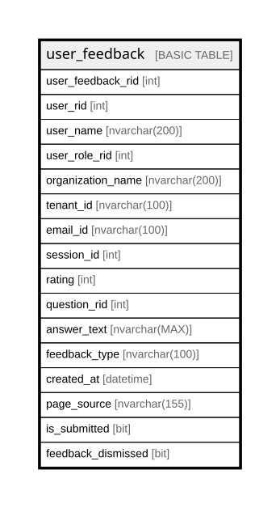

# user_feedback

## Description

UNKNOWN Usage - Ignore for now

## Columns

| Name | Type | Default | Nullable | Children | Parents | Comment |
| ---- | ---- | ------- | -------- | -------- | ------- | ------- |
| user_feedback_rid | int |  | false |  |  | Unique RowID for the record, part of composite primary key for the table after tenant_uuid, a unique clustered key for the table, Data type = int, Nullable = No |
| user_rid | int |  | false |  |  |  |
| user_name | nvarchar(200) |  | true |  |  |  |
| user_role_rid | int |  | true |  |  |  |
| organization_name | nvarchar(200) |  | true |  |  |  |
| tenant_id | nvarchar(100) |  | true |  |  |  |
| email_id | nvarchar(100) |  | true |  |  |  |
| session_id | int |  | true |  |  |  |
| rating | int |  | true |  |  |  |
| question_rid | int |  | true |  |  |  |
| answer_text | nvarchar(MAX) |  | true |  |  |  |
| feedback_type | nvarchar(100) |  | true |  |  |  |
| created_at | datetime | (getdate()) | false |  |  |  |
| page_source | nvarchar(155) |  | true |  |  |  |
| is_submitted | bit | ((0)) | false |  |  |  |
| feedback_dismissed | bit |  | true |  |  |  |

## Constraints

| Name | Type | Definition |
| ---- | ---- | ---------- |
| PK_user_feedback | PRIMARY KEY | CLUSTERED, unique, part of a PRIMARY KEY constraint, [ user_feedback_rid ] |

## Indexes

| Name | Definition |
| ---- | ---------- |
| PK_user_feedback | CLUSTERED, unique, part of a PRIMARY KEY constraint, [ user_feedback_rid ] |

## Relations

---

> Generated by [tbls](https://github.com/k1LoW/tbls)
