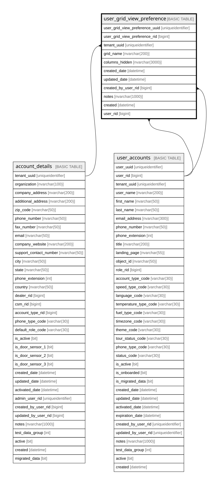

# user_grid_view_preference

## Columns

| Name | Type | Default | Nullable | Children | Parents | Comment |
| ---- | ---- | ------- | -------- | -------- | ------- | ------- |
| user_grid_view_preference_uuid | uniqueidentifier | (newsequentialid()) | false |  |  |  |
| user_grid_view_preference_rid | bigint |  | false |  |  |  |
| tenant_uuid | uniqueidentifier |  | false |  | [account_details](account_details.md) |  |
| grid_name | nvarchar(200) |  | false |  |  |  |
| columns_hidden | nvarchar(3000) |  | false |  |  |  |
| created_date | datetime | (getdate()) | false |  |  |  |
| updated_date | datetime |  | true |  |  |  |
| created_by_user_rid | bigint |  | true |  | [user_accounts](user_accounts.md) |  |
| notes | nvarchar(1000) |  | true |  |  |  |
| created | datetime | (getdate()) | false |  |  |  |
| user_rid | bigint |  | true |  | [user_accounts](user_accounts.md) |  |

## Constraints

| Name | Type | Definition |
| ---- | ---- | ---------- |
| pk_user_grid_view_preference_tenant_uuid_user_grid_view_preference_rid | PRIMARY KEY | CLUSTERED, unique, part of a PRIMARY KEY constraint, [ tenant_uuid, user_grid_view_preference_rid ] |
| uk_user_grid_view_preference_uuid | UNIQUE | NONCLUSTERED, unique, part of a UNIQUE constraint, [ user_grid_view_preference_uuid ] |
| uk_user_grid_view_preference_rid | UNIQUE | NONCLUSTERED, unique, part of a UNIQUE constraint, [ user_grid_view_preference_rid ] |
| fk_user_grid_view_pref_tenant_uuid | FOREIGN KEY | FOREIGN KEY(tenant_uuid) REFERENCES account_details(tenant_uuid) ON UPDATE NO_ACTION ON DELETE NO_ACTION |
| fk_user_grid_view_pref_user_id | FOREIGN KEY | FOREIGN KEY(user_rid) REFERENCES user_accounts(user_rid) ON UPDATE NO_ACTION ON DELETE NO_ACTION |
| fk_user_grid_view_preference_created_by_user_rid | FOREIGN KEY | FOREIGN KEY(created_by_user_rid) REFERENCES user_accounts(user_rid) ON UPDATE NO_ACTION ON DELETE NO_ACTION |

## Indexes

| Name | Definition |
| ---- | ---------- |
| pk_user_grid_view_preference_tenant_uuid_user_grid_view_preference_rid | CLUSTERED, unique, part of a PRIMARY KEY constraint, [ tenant_uuid, user_grid_view_preference_rid ] |
| uk_user_grid_view_preference_uuid | NONCLUSTERED, unique, part of a UNIQUE constraint, [ user_grid_view_preference_uuid ] |
| uk_user_grid_view_preference_rid | NONCLUSTERED, unique, part of a UNIQUE constraint, [ user_grid_view_preference_rid ] |
| ix_fk_user_grid_view_pref_tenant_uuid | NONCLUSTERED, [ tenant_uuid ] |
| ix_fk_user_grid_view_pref_user_id | NONCLUSTERED, [ user_rid ] |
| ix_fk_user_grid_view_preference_created_by_user_rid | NONCLUSTERED, [ created_by_user_rid ] |

## Relations

---

> Generated by [tbls](https://github.com/k1LoW/tbls)
