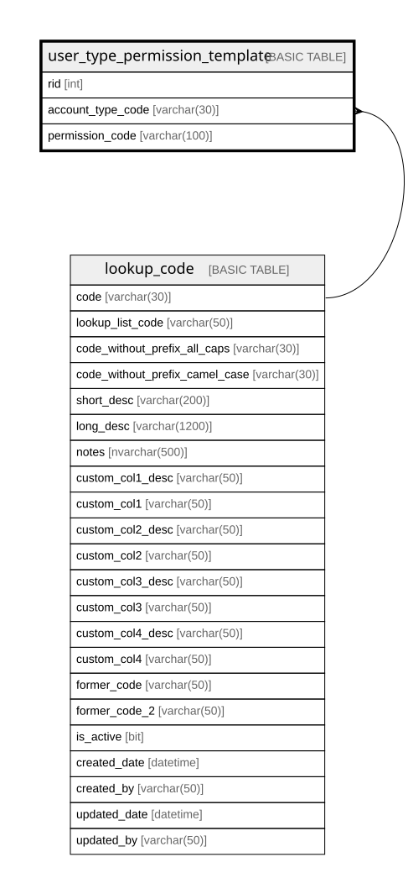

# user_type_permission_template

## Columns

| Name | Type | Default | Nullable | Children | Parents | Comment |
| ---- | ---- | ------- | -------- | -------- | ------- | ------- |
| rid | int |  | false |  |  |  |
| account_type_code | varchar(30) |  | true |  | [lookup_code](lookup_code.md) |  |
| permission_code | varchar(100) |  | false |  |  |  |

## Constraints

| Name | Type | Definition |
| ---- | ---- | ---------- |
| PK_user_type_permission_template | PRIMARY KEY | CLUSTERED, unique, part of a PRIMARY KEY constraint, [ rid ] |
| FK_user_type_permission_template_account_type | FOREIGN KEY | FOREIGN KEY(account_type_code) REFERENCES lookup_code(code) ON UPDATE NO_ACTION ON DELETE NO_ACTION |

## Indexes

| Name | Definition |
| ---- | ---------- |
| PK_user_type_permission_template | CLUSTERED, unique, part of a PRIMARY KEY constraint, [ rid ] |
| ix_user_type_permission_template_account_type_code | NONCLUSTERED, [ account_type_code ] |

## Relations

---

> Generated by [tbls](https://github.com/k1LoW/tbls)
